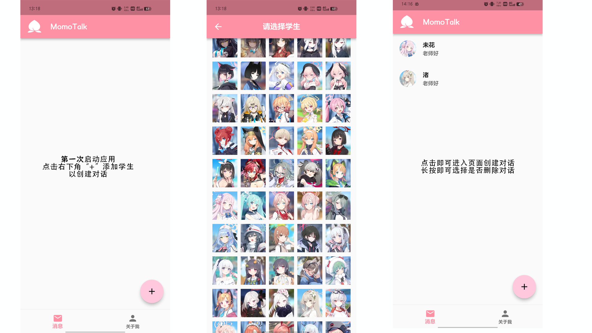
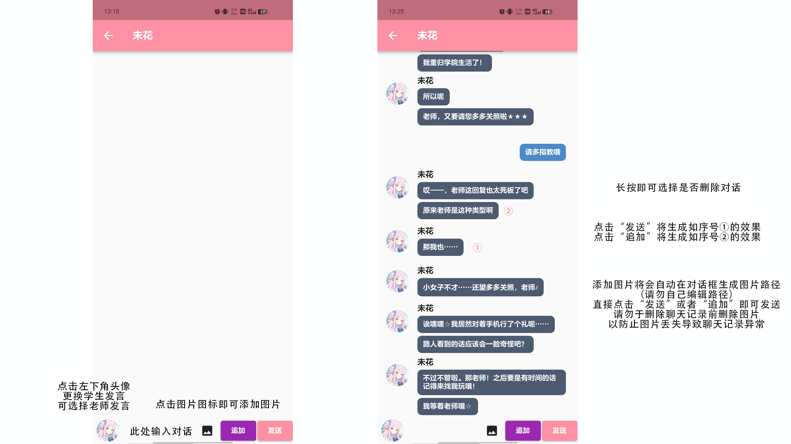
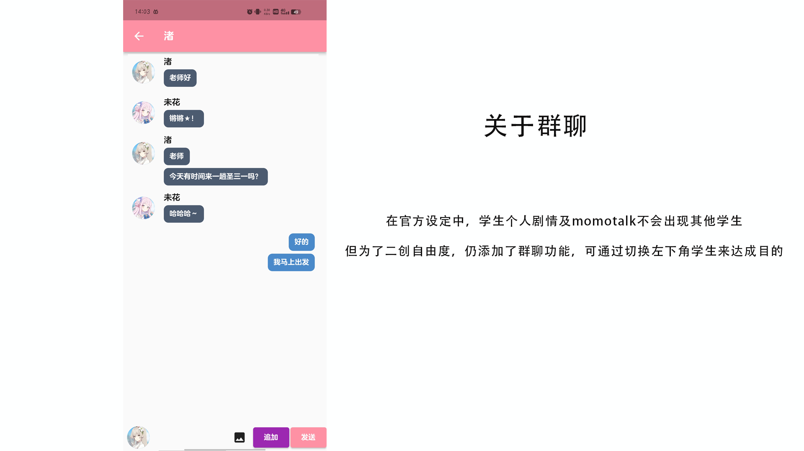

# MomoTalk Creator说明

## 一.软件下载

软件下载链接：https://gitee.com/honoki/momo-talk/releases

软件支持Android 9版本以上下载，选择适合手机架构的下载即可（大多数手机为armeabi架构，若下载后出现问题，则建议更换架构尝试）

作者主页：https://space.bilibili.com/328113450

## 二.软件使用说明

### 1.添加学生对话

### 2.创建聊天记录

### 3.关于群聊

## 三.关于学生名字汉化

因游戏有多个服务器以及学生有多个民间汉化的原因，未能出现所有学生名称统一的情况，我选择了多个大佬的翻译中个人最喜欢的版本

第一参考源：https://db.schale.top/

第二参考源：https://ba.gamekee.com/

民间参考源：

碧蓝档案资讯站【https://space.bilibili.com/37507923/】

威威字幕君【https://space.bilibili.com/7045822/】

## 四.反馈渠道

针对以上，如果你有对软件更好的建议或者有更好的翻译版本，请提出Issues

或反馈到邮箱childhood998@163.com

注：由该软件制作的意见或言论等均与软件作者无关。